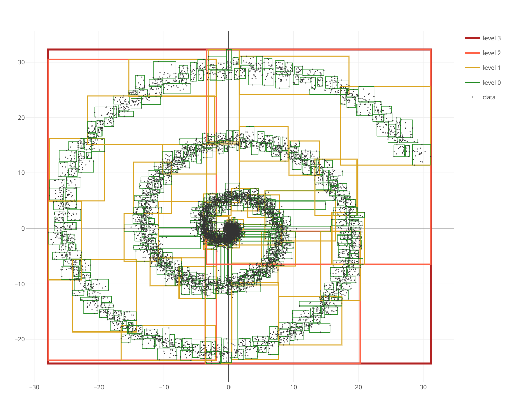

SpatialIndexing.jl
==============

[](https://travis-ci.org/alyst/SpatialIndexing.jl)
[](https://coveralls.io/github/alyst/SpatialIndexing.jl?branch=master)

`SpatialIndexing` package provides the tools for efficient in-memory indexing of
spatial data in Julia (http://julialang.org/).

# Installation
```julia
using Pkg; Pkg.add("SpatialIndexing")
```
from Julia REPL.

# Features

## R-tree

[R-tree](https://en.wikipedia.org/wiki/R-tree) organizes data into
hierarchical structure and ensures that:
  * minimal bounding rectangles (MBRs) of the nodes (rectangles that
    encompass all data elements in the subtree) stay compact,
  * MBRs of the nodes from the same R-tree level have minimal overlap
    with each other.

The key benefit of R-tree is its ability to rebalance itself
and maintain efficient structure while handling dynamic data (massive insertions
and deletions).

`SpatialIndexing` provides `RTree` type that supports:
  * different R-tree variants (classic [R-tree](https://en.wikipedia.org/wiki/R-tree),
[R*-tree](https://en.wikipedia.org/wiki/R*_tree), linear and quadratic node splits)
  * `insert!(tree, item)`, `delete!(tree, item)` for element-wise insertion and deletion
  * bulk-loading of data using Overlap-minimizing Top-down (OMT) approach (`load!(tree, data)`)
  * `subtract!(tree, reg)` for removing data within specified region `reg`
  * `contained_in(tree, reg)` and `intersects_with(tree, reg)` spatial queries

## Simple Spatial Index

`SimpleSpatialIndex` stores all data elements in a vector. So, while insertion
of new data takes constant time, the time of spatial searches grows linearly
with the number of elements. This spatial index is intended as a reference
implementation for benchmarking and not recommended for production usage.

**TODO**

# Usage

**TODO**

`examples` folder contains `spiral.jl` and `pareto.jl` examples of using R-tree
for storing spatial data.



# See also

Other Julia packages for spatial data:

  * [LibSpatialIndex.jl](https://github.com/yeesian/LibSpatialIndex.jl)
([libspatialindex](https://github.com/libspatialindex/libspatialindex) wrapper)
  * [NearestNeighbors.jl](https://github.com/KristofferC/NearestNeighbors.jl)
  * [RegionTrees.jl](https://github.com/rdeits/RegionTrees.jl)
  * [LSH.jl](https://github.com/Keno/LSH.jl)

# References

* A.Guttman, _“R-Trees: A Dynamic Index Structure for Spatial Searching”_
  Proc. 1984 ACM-SIGMOD Conference on Management of Data (1985), pp.47-57.
* N. Beckmann, H.P. Kriegel, R. Schneider, B. Seeger,
  _"The R*-tree: an efficient and robust access method for points and rectangles"_
  Proc. 1990 ACM SIGMOD international conference on Management of data (1990), p.322
* T. Lee and S. Lee, _"OMT: Overlap Minimizing Top-down Bulk Loading Algorithm for R-tree"_,
  CAiSE Short Paper Proceedings (2003) [paper](http://ceur-ws.org/Vol-74/files/FORUM_18.pdf)
